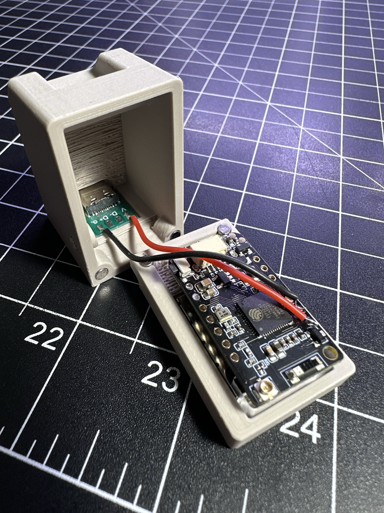

# Micro Macintosh
This is the smallest macintosh computer simulator I could make. It does not run any machintosh software but rather displays a series of Mac OS 7 screens. It can be upgraded to add more screens or pretty much anything you want.

It uses the Lilygo T-QT-Pro Microprocessor with a 128x128 pixel 0.85 inch full color screen. T-QT-Pro is a development board. It can work independently. It consists of ESP32-S3 MCU supporting Wi-Fi + BLE communication protocol and motherboard PCB. The screen is 0.85 inch IPS LCD GC9107. At the core of this module is the ESP32S3 chip. ESP32-S3 integrates Wi-Fi (2.4 GHz band) and Bluetooth 5.0(LE) solutions on a single chip.

# Case Build
This case was 3D printed on a Bambu Labs X1 Carbon using a cool plate with a PolyTerra PLA filament preset settings. I added all top surface ironing, and manual tree support. A 5mm outter brim only with a 0.1 gap

# Software
VS Code using <a href="https://piolabs.com/">PlatformIO</a> extension. Or Arduino software

# Recommended Supplies
<a href="https://a.co/d/bzfSieV">Female USB Type C Connector Breakout Board  Connector </a>

<a href="https://www.lilygo.cc/products/t-qt-pro">Lilygo T-QT-Pro</a>

<a href="https://www.aliexpress.us/item/3256804080730639.html?spm=a2g0o.order_list.order_list_main.33.21ef18022RxH8o&gatewayAdapt=glo2usa">Rotate Magnetic USB Cable Fast Type C Cable</a>

<a href="https://a.co/d/5LpBqJ4">3x2mm Refrigerator Magnets</a>

<a href="https://a.co/d/geAn1HZ">CA Glue</a>

<a href="https://a.co/d/5Ltns07">Polymaker Matte PLA Filament 1.75mm Muted White Filament<a>

Standard USB-C type connector for programming

